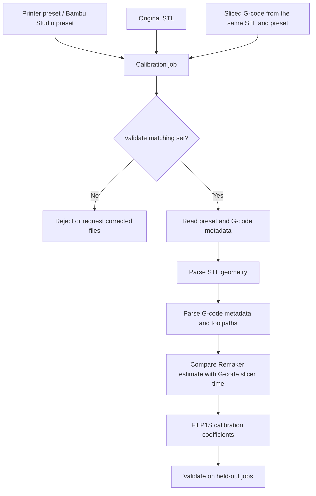
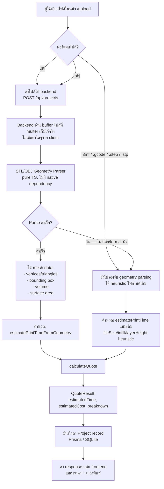
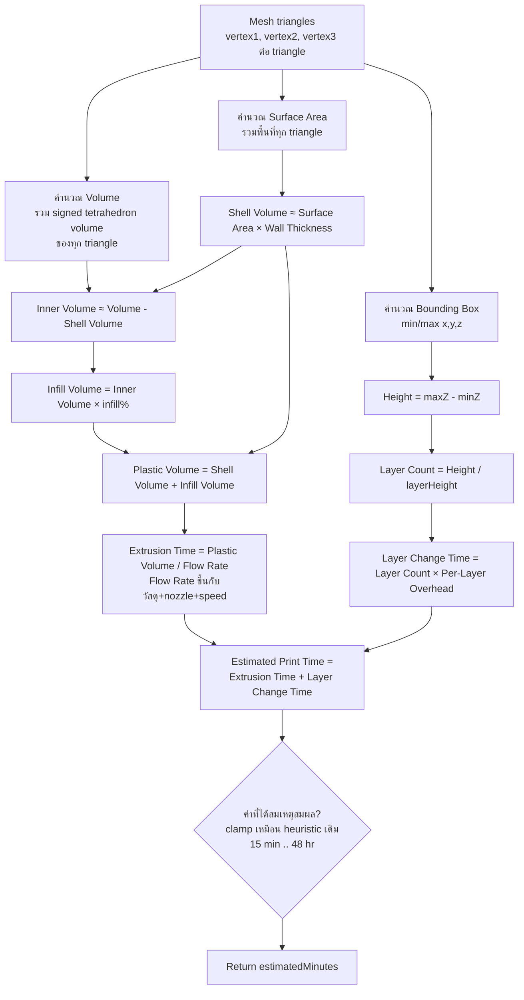
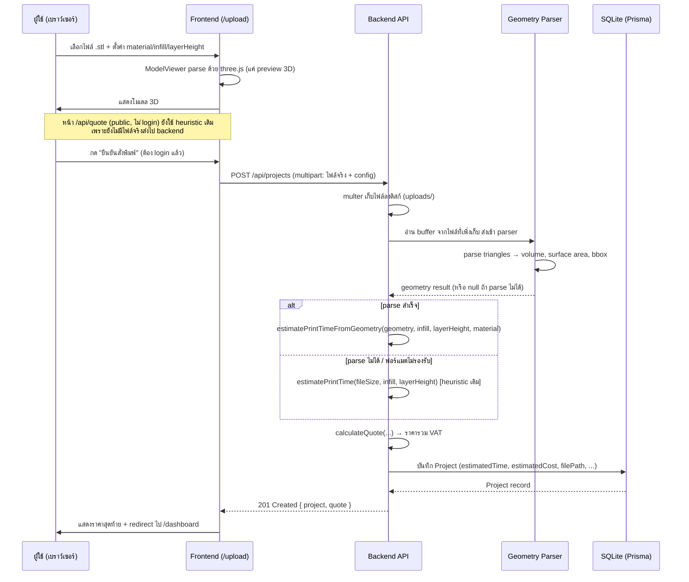
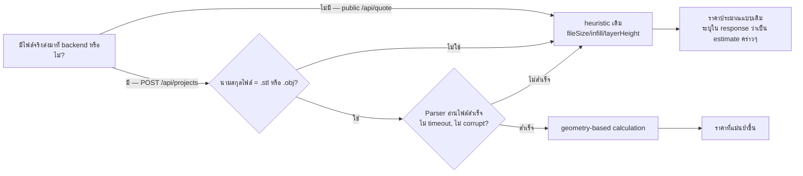

# Flowchart — Geometry-Based Pricing Engine

## 1) ภาพรวม data flow (จากอัปโหลดไฟล์ ถึง ราคาสุดท้าย)
## 0) Approved three-input calibration workflow

Required inputs are preset + STL + sliced G-code. Screenshot and actual print time are optional validation data.

## 2) รายละเอียดขั้น Geometry Parser → เวลาพิมพ์

## 3) Sequence ระหว่าง Frontend / Backend / Database (order flow เต็ม)

## 4) Fallback decision (เมื่อไหร่ใช้ geometry จริง vs heuristic)

